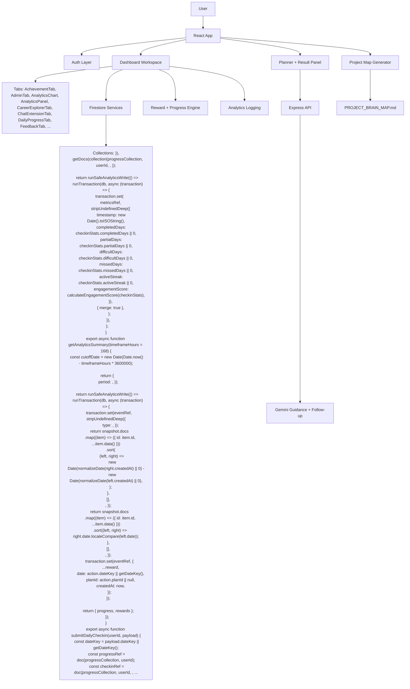

# Project Brain Map

_Auto-generated on 8 May 2026, 1:33 pm. This file updates from the repo structure and app/server entry points._

## What This Project Is

**Life Guidance Pro** is a full-stack planning app with:
- a React + Vite frontend
- Firebase Auth + Firestore persistence
- an Express backend for Gemini-powered plan generation and follow-up chat
- planner, goals, habits, reviews, rewards, analytics, reminders, profile, admin, and export flows

## Brain Map

## Runtime Flow

1. User signs in with Firebase Auth.
2. Frontend loads dashboard workspace and Firestore-backed user data.
3. Planner form submits to the Express backend.
4. Backend builds a Gemini prompt and returns a complete plan or follow-up response.
5. Frontend saves plan, goals, habits, reviews, progress, reminders, and analytics into Firestore.
6. Reward engine updates points, streaks, badges, milestones, and check-ins.
7. This map file is regenerated on dev-server startup, build startup, and file changes while Vite is running.

## Frontend Surface

- App shell: `src/App.jsx`
- Auth screen: `src/components/Login.jsx`
- Main workspace: `src/components/Dashboard.jsx`
- Shared styles: `src/App.css`
- Dashboard tabs:
  - `AchievementTab`
  - `AdminTab`
  - `AnalyticsChart`
  - `AnalyticsPanel`
  - `CareerExplorerTab`
  - `ChatExtensionTab`
  - `DailyProgressTab`
  - `FeedbackTab`
  - `GoalTab`
  - `HabitTab`
  - `Header`
  - `HistoryTab`
  - `HobbyIncomeTab`
  - `MissionsTab`
  - `MonthlyReviewTab`
  - `PersonalizationTab`
  - `PlannerBoard`
  - `PlannerTab`
  - `ProfileTab`
  - `ProgressWidget`
  - `ProjectMapTab`
  - `QuickAddModal`
  - `ReminderTab`
  - `ResultPanel`
  - `RoutineBuilderTab`
  - `SettingsTab`
  - `Sidebar`
  - `SupportTab`
  - `TaskCard`
  - `WeeklyProgressTab`
  - `WeeklyReviewTab`

## Backend Surface

- API server: `server/server.js`
- Routes:
  - `GET /`
  - `GET /healthz`
  - `POST /api/guidance`
  - `POST /api/followup`

## Data Layer

- Firestore-facing services:
  - `src/services/appData.js`
  - `src/services/progressData.js`
  - `src/services/dataCollection.js`
  - `src/services/rewards.js`
- Collections discovered from code:
  - `)),
    getDocs(collection(progressCollection, userId, `
  - `));

  return runSafeAnalyticsWrite(() =>
    runTransaction(db, async (transaction) => {
      transaction.set(
        metricsRef,
        stripUndefinedDeep({
          timestamp: new Date().toISOString(),
          completedDays: checkinStats.completedDays || 0,
          partialDays: checkinStats.partialDays || 0,
          difficultDays: checkinStats.difficultDays || 0,
          missedDays: checkinStats.missedDays || 0,
          activeStreak: checkinStats.activeStreak || 0,
          engagementScore: calculateEngagementScore(checkinStats),
        }),
        { merge: true },
      );
    }),
  );
}

export async function getAnalyticsSummary(timeframeHours = 168) {
  const cutoffDate = new Date(Date.now() - timeframeHours * 3600000);

  return {
    period: `
  - `));

  return runSafeAnalyticsWrite(() =>
    runTransaction(db, async (transaction) => {
      transaction.set(eventRef, stripUndefinedDeep({
        type: `
  - `));
      return snapshot.docs
        .map((item) => ({ id: item.id, ...item.data() }))
        .sort(
          (left, right) =>
            new Date(normalizeDate(right.createdAt) || 0) -
            new Date(normalizeDate(left.createdAt) || 0),
        );
    },
    [],
    `
  - `));
      return snapshot.docs
        .map((item) => ({ id: item.id, ...item.data() }))
        .sort((left, right) => right.date.localeCompare(left.date));
    },
    [],
    `
  - `));
      transaction.set(eventRef, {
        ...reward,
        date: action.dateKey || getDateKey(),
        planId: action.planId || null,
        createdAt: now,
      });
    });

    return { progress, rewards };
  });
}

export async function submitDailyCheckin(userId, payload) {
  const dateKey = payload.dateKey || getDateKey();
  const progressRef = doc(progressCollection, userId);
  const checkinRef = doc(progressCollection, userId, `
  - `));
      transaction.set(eventRef, {
        ...reward,
        date: dateKey,
        planId: payload.planId || null,
        createdAt: now,
      });
    });

    return {
      progress,
      rewards,
      checkin: {
        date: dateKey,
        status: payload.status,
        note: payload.note || `
  - `));
  const timestamp = new Date().toISOString();

  return runSafeAnalyticsWrite(() =>
    runTransaction(db, async (transaction) => {
      transaction.set(eventRef, stripUndefinedDeep({
        type: `
  - `),
    where(`
  - `);

function normalizeDate(value) {
  if (!value) return null;
  return typeof value?.toDate === `
  - `);

function sortByNewest(items) {
  return items.sort((left, right) => {
    const leftValue = typeof left.createdAt?.toDate === `
  - `);
const careerExplorationsCollection = collection(db, `
  - `);
const feedbackCollection = collection(db, `
  - `);
const goalsCollection = collection(db, `
  - `);
const reviewsCollection = collection(db, `
  - `);
const routineBuildersCollection = collection(db, `
  - `adjustment_events`

## Environment Variables

- `VITE_FIREBASE_API_KEY`
- `VITE_FIREBASE_AUTH_DOMAIN`
- `VITE_FIREBASE_DATABASE_URL`
- `VITE_FIREBASE_PROJECT_ID`
- `VITE_FIREBASE_STORAGE_BUCKET`
- `VITE_FIREBASE_MESSAGING_SENDER_ID`
- `VITE_FIREBASE_APP_ID`
- `VITE_FIREBASE_MEASUREMENT_ID`
- `VITE_API_BASE_URL`
- `VITE_ADMIN_EMAILS`

## Tooling

- Package: `life-guidance-pro`
- Frontend scripts:
  - `dev`: `vite`
  - `build`: `vite build`
  - `lint`: `eslint .`
  - `preview`: `vite preview`
  - `project:map`: `node scripts/generate-project-map.mjs`
  - `project:map:watch`: `node scripts/watch-project-map.mjs`
- Vite config present: `yes`

## High-Level File Map

### src/
- `src/App.css`
- `src/App.jsx`
- `src/assets`
- `src/assets/hero.png`
- `src/assets/react.svg`
- `src/assets/vite.svg`
- `src/components`
- `src/components/AppErrorBoundary.jsx`
- `src/components/dashboard`
- `src/components/dashboard/AchievementTab.jsx`
- `src/components/dashboard/AdminTab.jsx`
- `src/components/dashboard/AnalyticsChart.jsx`
- `src/components/dashboard/AnalyticsPanel.jsx`
- `src/components/dashboard/CareerExplorerTab.jsx`
- `src/components/dashboard/ChatExtensionTab.jsx`
- `src/components/dashboard/DailyProgressTab.jsx`
- `src/components/dashboard/FeedbackTab.jsx`
- `src/components/dashboard/GoalTab.jsx`
- `src/components/dashboard/HabitTab.jsx`
- `src/components/dashboard/Header.jsx`
- `src/components/dashboard/HistoryTab.jsx`
- `src/components/dashboard/HobbyIncomeTab.jsx`
- `src/components/dashboard/MissionsTab.jsx`
- `src/components/dashboard/MonthlyReviewTab.jsx`
- `src/components/dashboard/PersonalizationTab.jsx`
- `src/components/dashboard/PlannerBoard.jsx`
- `src/components/dashboard/PlannerTab.jsx`
- `src/components/dashboard/ProfileTab.jsx`
- `src/components/dashboard/ProgressWidget.jsx`
- `src/components/dashboard/ProjectMapTab.jsx`
- `src/components/dashboard/QuickAddModal.jsx`
- `src/components/dashboard/ReminderTab.jsx`
- `src/components/dashboard/ResultPanel.jsx`
- `src/components/dashboard/RoutineBuilderTab.jsx`
- `src/components/dashboard/SettingsTab.jsx`
- `src/components/dashboard/Sidebar.jsx`
- `src/components/dashboard/SupportTab.jsx`
- `src/components/dashboard/TaskCard.jsx`
- `src/components/dashboard/WeeklyProgressTab.jsx`
- `src/components/dashboard/WeeklyReviewTab.jsx`

### server/
- `server/.env`
- `server/.env.example`
- `server/package-lock.json`
- `server/package.json`
- `server/server.js`

### docs and config
- `.env`
- `.env.example`
- `.gitignore`
- `AI_IMPROVEMENT_GUIDE.md`
- `archive/new_components_prototype/dashboard_new/new_dashboard.jsx`
- `archive/new_components_prototype/new_layout/applayout.jsx`
- `archive/new_components_prototype/new_layout/header.jsx`
- `archive/new_components_prototype/new_layout/rightpanel.jsx`
- `archive/new_components_prototype/new_layout/sidebar.jsx`
- `archive/new_components_prototype/sections/overview.jsx`
- `archive/new_components_prototype/sections/plannersection.jsx`
- `archive/new_components_prototype/sections/statsgrid.jsx`
- `DATA_COLLECTION_SUMMARY.md`
- `DEPLOYMENT_CHECKLIST.md`
- `eslint.config.js`
- `firestore.rules`
- `index.html`
- `MODERN_UI_REDESIGN.md`
- `package-lock.json`
- `package.json`
- `postcss.config.js`
- `PROJECT_BRAIN_MAP.md`
- `public/favicon.svg`
- `public/icons.svg`
- `public/PROJECT_BRAIN_MAP.md`
